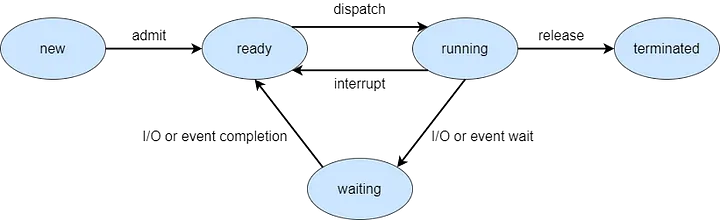
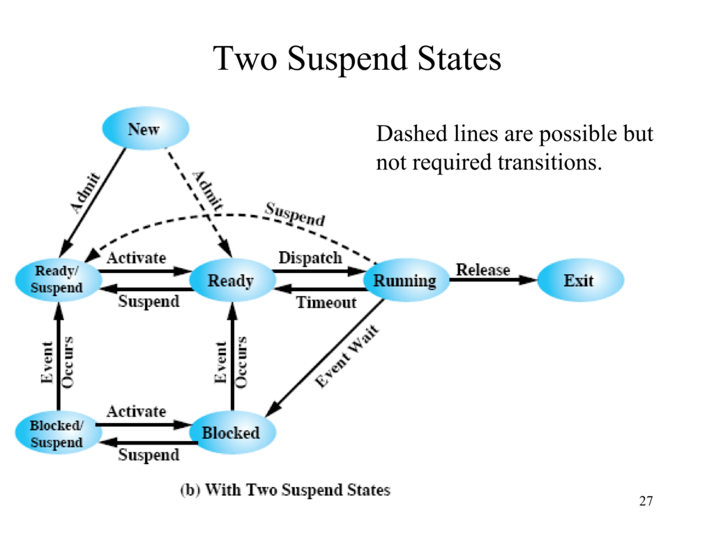
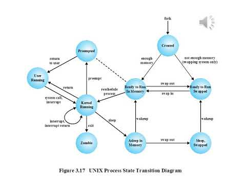
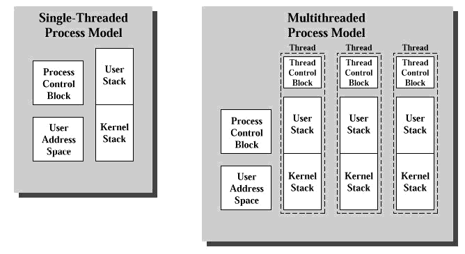
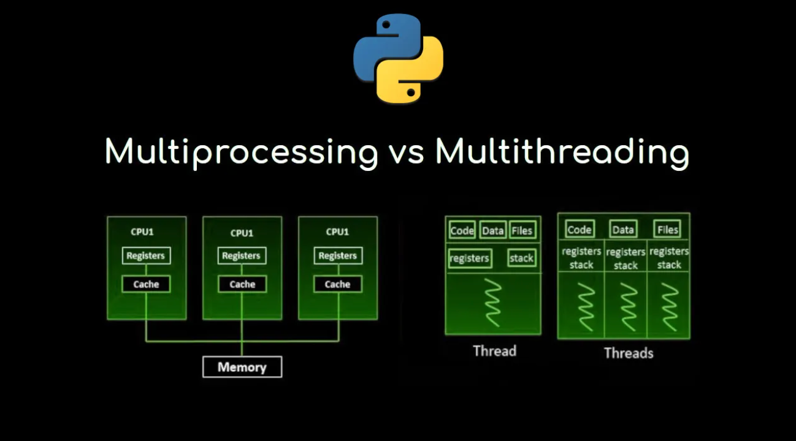

# 운영체제 - 최린 교수님 강의 정리

#### 목차
1. [OS Overview](#1-os-overview)
2. [Process](#2-process)
3. [Thread](#3-threads)
4. **[Mutual Exclusion and Synchronization](#4-mutual-exclusion-and-synchronization)**
5. [Deadlock and Starvation](#5-deadlock-and-starvation)
6. [Memory Management](#6-memory-management)
7. [Virtual Memory]
8. [Uniprocessor Scheduling]
9. [Multiprocessor and Realtime Scheduling]
10. [IO]
11. [File Management]
12. [Virtual Machine]
---
### 1. OS Overview

- 1강(250515)
    - 디지털 시스템이 컴퓨터가 되기 위한 조건?
        ```txt
        " 조건 -> 계산 -> 판단을 할 수 있는 CPU 같은 장치가 존재하며 프로세싱이 가능해야한다. "
        " 상태 값을 가져야한다. "

        - 쉽게 설명해보기
        : 컴퓨팅 (연산, 상태값 저장 등을 하는 행위) 작업이 가능해야한다.
        즉, 사람처럼 어떠한 기준으로 판단을 할 수  있어야한다. 
        (조건에 따라 다른 동작을 할 수 있어야 한다)
        그걸 할 수 있게 해주는 것이 CPU 와 같은 장치이다.
        ```
    - 컴퓨터 시스템에서 OS란 무엇이냐?
        ```txt
        " 하드웨어 리소스를 쉽게 조작할 수 있도록 도움을 주고, "
        " 하드웨어와 유저레벨 사이에서 인터페이스를 제공해주는 것이다. "

        - 쉽게 설명해보기
        : 우리가 컴퓨터를 조작하기위해 본체를 뜯어서 전기신호를 직접 주지않고 
        키보드, 마우스 등의 입력, 출력 장치를 가지고 조작할 수 있는 이유이다.
        Windows , Linux , MacOS , UNIX 등이 있다.
        ```

- 2강(250516)
    - Compute vs I/O , CPU 가용률을 높혀라
        ```txt
        아래와 같이 Task가 있을 때,
        Task 1 : I/O 15us
        Task 2 : Compute 1us
        Task 3 : I/O 15us
        CPU 가동률은 1/31 ~=> 3.23%

        순차적 Task 실행은 값 비싼 CPU 를 너무 활용못하는게 아닐까?
        `멀티 태스킹`개념이 도입된 배경이다.
        ```

---
### 2. Process
- 2강(250516)
    - 프로세스란 ?
        ```txt
        " 프로그램의 인스턴스 "
        > 하나의 프로그램 (명령어와 데이터들의 뭉치) 을 기반으로 찍어낸 인스턴스이다.
        > 여러 프로세스가 실행 중이어도 각 프로세스는 자신이 단독으로 실행되는 것처럼 느낀다 (일루전).
        ```

    - Private Address Spaces
        ```txt
        프로세스가 가지는 주소공간 (가상 메모리)
        여기 있는 주소를 물리적 메모리(DRAM)의 주소로 변환하여 사용한다.
        이는 컴퓨터에 자기 혼자 존재하는것 같은 일루전을 제공한다.
        ```

    - Life vs scope
        ```txt
        이를 이해하기 위해서는 변수와 메모리구조에 대한 이해가 필요한데, SKIP하도록 하겠다.
        Life :  스택메모리에 저장된 변수들과 같이 지역변수가 스택이 해제되었을 때 소멸하는 등 
                변수의 생명주기를 뜻한다.
        scope : '생존한' 변수들에게 접근 가능한 영역범위, 예로, Func1 , Func2 두가지 영역이 있을 때,
                Func1 스택메모리 스코프를 가지고 있을 때, Func2 의 변수에 접근하지 못한다.

        Life 하지만 scope 가 불가능하다. 는 존재하지만
        Life 하지 않고 scope 가 가능하다는 말이 안됨.
        ```

    - **Context Swiching**
        ```txt
        Context : 프로세스가 실행되던 시점의 CPU 레지스터 값, 스택 포인터, 프로그램 카운터 등의 정보 집합

        어떠한 시스템콜에 의하여 실행중인 프로세스의 context를 저장하고 다른 프로세스를 cpu로 올리는 작업
        대표적으로 타임 스케쥴링기반으로 실행되는 컴퓨터에서 타임 인터럽트가 발생하는 순간, 
        혹은 IO작업 발생시
        실행중인 Context를 저장하고 다른 프로세스를 올리는 작업을 하게된다.
        ```

    - 시스템 콜, 그리고 커널 
        ```txt
        시스템 콜 : 사용자 프로그램이 커널 모드로 진입하기 위해 의도적으로 발생시키는 소프트웨어 인터럽트

        커널: 유저 모드에서 실행 중인 프로그램이 하드웨어에 직접 접근하지 못하게 막고, 
        그 요청을 대신 처리해주는 관리자.
        운영체제의 핵심이자, 하드웨어와 소프트웨어를 연결하는 다리 역할을 한다.
        ```

- 3강 (250517)
    - Process Control Block
        ```txt
        OS가 각 프로세스를 구분 및 관리하기위해 메모리에 저장하는 `데이터 구조체`
        하나의 프로세스는 하나의 PCB 를 가지며 커널영역 메모리에 저장된다.

        구성 정보는 아래와 같다.
        PID : 프로세스 고유번호
        state : 현재 프로세스의 상태 (ready, block ...)
        PC : 프로그램 카운터
        레지스터 : 연산 도중 보관해야할 레지스터 값들 (컨텍스트 스위칭 시 덮어씌워지니까)
        메모리 : 코드 데이터 스택 힙 등의 위치정보 (가상메모리 정보)
        I/O 상태 : 어떤 파일 및 입출력 장치를 사용하는가
        계정정보 : 유저ID , 권한 등
        우선순위 : 스케쥴링 시 사용
        ```

    - Dispatcher , Process Execution and Traces
        ```txt
        Dispatcher : 프로세스 간 전환(switch)을 담당하는 OS 구성요소
                     컨텍스트 스위칭 수행, 타이머 시작
                     스케쥴러가 다음 프로세스를 고른다면, 디스패쳐는 전환을 실제로 수행한다.
        Process Excecution : OS가 프로세스를 생성하고, 실행상태로 진입시키고, 종료하는 전체과정을 의미
                        예)  NEW -> READY -> RUNNING -> WAITING -> READY -> RUNNING -> TERMINATED
        Traces : 프로세스가 실행되는 동안 수행한 명령어 주소의 시퀀스 (흔적) 실행 로그와 같은 것으로 이해
        ```

    - Process Creation and Termination
        ```txt
        Process Creation : 새로운 프로세스를 생성하는 작업, 부모 프로세스가 자식 프로세스를 만들어
                           새로운 작업을 맡기는 형태로 이루어진다.
                           fork() 생성 -> exec() 다른 프로그램으로 덮어씀
        Termination : 실행이 끝나거나, 강제종료되는 상황. OS는 프로세스를 clean-up 해줘야함.
               흐름 : PCB 제거준비 -> 리소스 반납 -> state : ZOMBIE -> 부모가 wait() 호출

        흥미로운 점, 
            모든 프로세스는 부팅시 생성되는 조상 프로세스의 후손들이다, 모두가 이어져있다는 사실
        ```

    - fork
        ```txt 
        현재 실행 중인 프로세스를 복제해서, 똑같은 새 프로세스를 하나 더 만드는 시스템 콜

        사용하는 이유 ?
            병렬 작업 , 백그라운드 작업 분리 , exec()와 함께 새 프로그램 실행
        
        어떤 복사가 일어날까,
            Copy-on-Write(CoW) 기술 사용.
                처음엔 부모와 자식이 같은 메모리 페이지를 공유
                누군가 데이터를 변경할 때 깊은 복사가 일어남 -> 성능 최적화

        리턴값
        부모 프로세스 : 자식의 PID
        자식 프로세스 : 0
        실패          : -1
        ```

    - Five-State Process Model

        

        ```txt
        OS가 프로세스의 상태를 추적하고 관리하기 위해 사용하는 5가지 상태모델
        ```
    
    - Suspended Processes
        ```txt
        프로세스가 일시적으로 메모리에서 제거되고, 디스크로 스왑되어 대기 상태가 되는 것.
        Swapping : 메모리 부족으로 인해 프로세스를 메모리 밖으로 쫓아내는 작업

        메모리에 프로세스가 많이 올라와있으나, IO작업 등으로 인해 모든 프로세스가 
        block 상태가 되어 있다면 CPU는 띵가띵가 놀고있음, 효율을 위해 메모리 밖으로 쫓아내고
        새로운 프로세스를 들여온다.
        ```
    
    - **Two Suspend State (7-state Process Model)**
        
        

        ```txt
        이해 부족 부분 정리
        New -> Admit 상황 : 이는 물리적으로 메모리 공간이 있다 라는 의미가 아닌 그저 PCB 만들고 입장허용한 상태임.
        그래서 분기가 나뉘게 된다.
        1. 메모리 여유 : New -> Ready
        2. 메모리 부족 : New -> Suspended Ready

        Suspended Ready : 스케쥴러의 선택을 못받아 Ready 도중 메모리에서 쫓겨남
        Suspended Blocked : IO 요청 기다리다가 메모리에서 쫓겨남
        Running -> Suspended Ready : 실행 도중 kill() 혹은 메모리 부족으로 인해 쫓겨남 (심각한 상황)
        ```

    - **Interrupt / Exception**
        ```txt
        User Mode <-[Interrupt||Exception]-> Kernel Mode

        Interrupt : 외부적인 이벤트 (external , Asynchronous)
            #INT : 일반적인 인터럽트
            #NMI : None Maskable Interrupt -> 인터럽트가 disable 되어도 실행되는 인터럽트
            return to next

        Exception : 프로그램 실행 중에 예외가 발생 (internal , Synchronous)
            Faults  : 명령어를 마치지 못함(page miss ...)(의도적이지않음, Return to next)
            Traps   : 명령어를 마치고 발생(Debug, system call ...)(의도적임)
            Aborts  : 프로그램을 종료해야할 만큼 심각한 오류. (parity error...)
        
        인터럽트 / 예외 이벤트가 발생 → OS의 커널이 등록한 이벤트 핸들러(ISR)가 실행된다.
        이벤트(인터럽트)는 하드웨어/펌웨어에서 발생하지만,
        그 처리는 OS 커널이 수행하며, 핸들러 코드는 OS에 존재한다.
        
        즉, 이벤트는 하드웨어/펌웨어가 발생시키고, 핸들러는 커널에 있다.
        ```

- 4강 (250518)
    - UNIX System V Process Management

    

### 3. Threads
- 4강 (250518)
    - 들어가며
        ```txt
        기본적인 Thread : OS의 스레드

        하드웨어의 Thread(하이퍼스레딩 ...) 
            : ProgramCounter 가 두개, 독립적인 프로세스라 할 수 있음, OS의 스레드와 다르다. 
            : 간단히만 알고있자.
        ```

    - Multithreaded Process Model
        
        

    - 멀티 프로세싱 vs 멀티 스레딩
        
        ```txt
        멀티 프로세싱
            각 프로세스별로 PCB 생성, 각각의 리소스,IO ... 자원이 모두 독립적임
            스케쥴링 단위가 프로세스임
            무겁고 복잡하다.
            하지만 성능 희생을 감수하고라도 격리성과 안정성이 필요한 곳에 쓸 수 있다.

        멀티 스레딩
            한 프로세스의 PCB를 공유, 리소스,IO ... 자원을 공유함
            스케쥴링 단위가 스레드가 되기 때문에
            스레드별 스레드컨트롤블락(스택포인터, 컨택스트정보, state저장)이 생김
            가볍고 효율적이다, 허나 공유 자원 접근에 대한 동기화 및 디버깅이 어려운 단점이 있다.
            위 그림에서 보이다 싶이, 하나의 운명 공동체 이다.

        컴퓨터세계의 방법론 중에서 무조건 이게 정답이다! 는 없다고 본다.
        상황에 맞추어 사용하기위해 둘 다 잘 알아놓자.
        ```


    - Process Characteristics
        ```txt
        Resource ownership : 리소스의 주체가 프로세스 단위임
        scheduling unit : 스케쥴링이 되는 단위 -> 기존 Process
        Two characteristics are independent
            : 스케쥴링 단위만 -> thread 단위로 (Lightweight process)
        ```
    
    - Multithreading
        ```txt
        멀티스레딩을 사용하는 이유

            빠른 응답
            병렬 처리
            효율적인 메모리, 리소스 공유
            성능 가성비가 좋다.

        멀티스레딩을 위해 필요한 것들

            thread execution state : Ready, Run
            thread context : 스레드 별 상태정보
            thread execution stack : 스레드 별 스택메모리 공간

        특징
            `스레드들은 하나의 운명 공동체` 이기 때문에
            Suspend 시 모든 스레드가 쫓겨남
            kill 시 모든 스레드가 좀비가 됨

        멀티스레딩 프로세스 예시

            Foreground and background jobs
            Asynchronous processing
            Batch processing
        ```

- 5강 (250519)
    - User Level Threads (ULTs)
        ```txt
        유저 레벨에서의 스레드, 멀티스레딩인척하는 눈속임이 아닐까?
            장점 
                Application 자체적으로 스케쥴을 한다. -> 커널진입이 없음으로 가볍다.
                맞춤형 스케쥴링이 가능하다.
                커널을 필요로하지 않기 때문에 어디서나 실행이 가능하다.
            단점
                프로세스가 Block 이 되면 모든 스레드가 Block이 된다.
                하나의 프로세스에서 하나의 프로세서만 이용가능하다.
                즉, 멀티 스레딩의 장점을 이용할 수 없다.
            왜 필요할까?
        ```

    - Kernel Level Threads (KLTs)
        ```txt
        OS 레벨에서의 스레드, 찐 스레드
            장점
                멀티 스레딩의 장점을 모두 이용가능하다.
            단점
                Context Switching 비용이 발생, 오버헤드가 ULT 보다 비교적 크다.
                스레드 생성/소멸 비용이 큼
                OS 스케줄러가 유저 의도대로 움직이지 않음 (맞춤 스케줄링 불가)

            왜 필요할까?
                멀티코어 활용이나 비동기 IO 처리 등의 상황에서
                병렬성 확보와 블로킹 회피를 위해 필요하다
        ```

    - Combined Approach
        ```txt
        ULT 와 KLT 의 장점을 모두 살리고싶은 욕심쟁이의 접근법

            여러 개의 ULT → 적은 수의 KLT에 매핑 (M:N)
            각 KLT가 여러 ULT를 감싸는 구조

        스레드 풀 개념과 유사한 점
            KLT 수 제한 → 스레드 풀처럼 자원 관리함
            내부에 유저 스레드들을 매핑해서 효율적으로 돌림
        ```
    
    - Performance Impact of Multicores
        ```txt
        암달의 법칙
            : 멀티 스레드 에서 병렬처리가 불가능한 직렬적인 작업들이 성능과 직결된다.
            
                1 / ((병렬 / 코어수) + (직렬 작업)) = 스피드업  
            
            즉, 병렬처리가 불가능한 직렬 작업(inherently serial)이 속도를 결정하는데 크게 기여한다.
        ```
    
    - Solaris 에서의 용어
        ```txt
        Process             : 프로세스
        User-level thread   : ULT
        Lightweight process : ULT 를 KLT 에 매핑 (Combined 접근)
        Kernel thread       : 매핑되지 않은 OS 커널 스레드
        ```

---

### 4. Mutual Exclusion and Synchronization
- 5강(250519)
    - Process Interaction
        ```txt
        Mutual exclusion 
            : 두 프로세스가 하나의 프린터를 필요로 할 때
            -> 원하지 않는 결과가 나올 수 있다.
            -> 한번에 한 프로세스만 접근할 수 있도록 크리티컬 섹션으로 보호해줘야한다.
            how ? 한 프로세스가 크리티컬 섹션에서 작업중일 때 컨텍스트 스위칭을 멈춘다면?
        Deadlock
            : 리소스 R1, R2가 둘다 있어야 작업이 가능할 때, 한명이 R1을 , 한명이 R2를 들고있는 상황
            -> 그 누구도 양보할 생각이 없음.
            -> 평생 기다림.
        Starvation
            : 인싸들이 계속 리소스를 사용해서 왕따 당하는 녀석에게 리소스가 들어오지 않는 상황
            -> 스케쥴러로 인해, 어떤 프로세스에게 리소스가 할당되지 않는 상황
        Race condition
            : 전역 데이터에 두 프로세스 이상 접근하여 서로 교차하여 실행되는 상황
            -> 예상하지 못한 결과가 나올 수 있다.
        ```

- 6강(250520)
    - Critical section
        ```txt
        하나의 리소스를 둘 이상의 스레드가 동시에 접근하면 문제가 생기므로, 
        "상호 배제(Mutual Exclusion)" 가 필요하다.

        이를 보장하는 영역이 바로 Critical Section

        어떻게 구현할까?
            : 인터럽트를 disable 하는 방식은 싱글 코어에선 유효할지 몰라도, 멀티스레딩 상황에선 성립하지않는다.
            , 또 CS 자체가 막히기 때문에 CPU 사용률 측면에서도 불리할 것이다. 그렇다면 어떻게 해결가능할까.
            -> 먼저 Atomic Operation을 알아야한다.
        ```
    
    - Atomic Operation
        ```txt
        "All or Nothing" 이라는 속성 덕분에 중간에 끼어들 수 없으므로 동기화에 적합.
        
        대표 예시:
            Test-and-Set
            Compare-and-Swap
            Fetch-and-Add

        2개이상의 명령어를 하나의 Atomic operation 으로 정의 해놓은 것.
        ```

    - HW Support for Mutex
        ```txt
        하드웨어단 에서 Special machine instructions 제공
            Test-and-set , fetch-and-add, compare-and-swap ... -> Atomic Operation
        Problem
            Busy Waiting : 계속해서 test-and-set , compare ... 연산을 하기 때문에 CPU 낭비가 생기는 현상
            Deadlock and Starvation can also happen ...
        ```
    
    - Critical Section by Compare-and-Swap , Exchange
        ```txt
        무한 루프 돌면서 lock 획득 경쟁하는 과정
        누군가 작업중이라면 lock state = 1
        작업이 끝난다면 lock state = 0

        state 가 0 일 때 경쟁중인 스레드중 하나가 락을 쥐고(1로 만들고) 작업을 진행한다.
        ```
        ```cpp
        bool CompareAndSwap(int* addr, int expected, int new_val) {
            if (*addr == expected) {
                *addr = new_val;
                return true;
            }
            return false;
        }
        ```

    - 특별한 명령어(Atomic Oper)의 장점과 단점
        ```txt
        장점
            멀티 프로세서 환경에서도 크리티컬 섹션 보장
            쉽고 간단하다.
            리소스 당 크리티컬 섹션을 부여할 수 있다.
        단점
            Busy-waiting
            Starvation 발생가능
            Deadlock 발생가능
        ```
    
    - Semaphore
        - 예시 흐름 T1 ~ T4 스레드 4개가 순차적으로 세마포어 진입

        | 시점 | 동작 | S 값 변화 | 대기 큐 | 설명 |
        |:----:|:----:|:---------:|:-------:|:----:|
        | 0 | Init | 1 | [] | 자원 1개 준비 |
        | 1 | T1 P() | 0 | [] | T1 실행 시작 |
        | 2 | T2 P() | -1 | [T2] | 자원 없음 → Block |
        | 3 | T3 P() | -2 | [T2, T3] | Block |
        | 4 | T4 P() | -3 | [T2, T3, T4] | Block |
        | 5 | T1 V() | -2 → -2 | [T3, T4] | T2 깨움 → 바로 실행, 값은 그대로 |
        | 6 | T2 V() | -1 → -1 | [T4] | T3 깨움 |
        | 7 | T3 V() | 0 | [] | T4 깨움 |
        | 8 | T4 V() | 1 | [] | 자원 반납 완료 |

        ```txt
        리소스 접근을 관리해주는 특별한 변수

        initialized operation
            : non-negative integer value

        V operation ("signal")
            : Increment the semaphore , wait Queue 에 스레드가 있다면 깨움
            : 분기 1. 레디큐에 스레드존재 -> 스레드 깨움 -> s++;
                   2. 레디큐가 비었음 -> s++;

        P operation ("wait")
            : Decrement the semaphore , 자원이 없다면 Block
            : 일단 s-- , s < 0 이라면 레디큐로 들어감.

        Type of semaphores
            Binary semaphore (Mutex 대용으로 사용가능)
                - Have a value of 0 or 1
                    0 (locked)
                    1 (unlocked)
            Counting semaphore
                - Can have an arbitrary resource count

            Strong semaphore
                - FIFO 보장 (큐 사용)
            Weak semaphore
                - 큐를 사용하지 않음
        ```

- 7강 (250521)
    - Producer/Consumer Problem
        ```txt
        프로듀서 - 공유 버퍼 - 컨슈머 구조
            공유 버퍼 동기화가 필요함. (크리티컬 섹션으로 보호)
            * 중요 : 버퍼가 비었을 때 컨슈머의 접근을 막아줘야함. (데드락 발생)

        흐름 설명 (의도):
            n : 세마포어 (버퍼에 남은 공간 or 아이템 개수 추적용)
            s : 크리티컬 섹션 보호용 (Mutex 역할)

        produce()
            wait(n)           // 자원이 남았는지 확인 (ex: 버퍼 공간)
            wait(s)           // 공유 버퍼 접근 진입 (mutex lock)
            append()          // 생산된 아이템 버퍼에 넣기
            signal(s)         // mutex unlock

        consume()
            wait(s)           // 공유 버퍼 접근
            take()            // 아이템 가져오기
            signal(s)         // unlock

            signal(n)         // 버퍼 공간 하나 확보됨
            consume()         // 실제 소비 처리

        n은 버퍼 공간 or 아이템 개수 추적용 세마포어
        s는 mutex 역할
        하지만 이런 방식은 데드락에 취약하고 복잡 
        -> 그래서 고수준 동기화 도구(모니터, 메시지 패싱)가 등장하게 됨
        ```
    
    - Monitor
        ```txt
        구성 요소:
            - Mutex lock          (상호배제)
            - Condition Variable  (조건 대기)
            - 대기 큐             (자동 관리)

        API:
            - cwait(c): 조건 만족할 때까지 대기 (wait)
            - csignal(c): 조건 만족됨을 알림 (notify)

        프로듀서:
            if (버퍼가 꽉참) 
                cwait(full)
            else 
                append()

        컨슈머:
            if (버퍼가 비었음)
                cwait(empty)
            else
                take()
        ```

    - Message Passing
        ```txt
        프로세스 간 통신(IPC) 모델

        제공 기능:
            1. Mutual exclusion (자원 동시 접근 방지)
            2. Synchronization  (타이밍 맞춤)
            3. Communication     (데이터 교환)

        메서드:
            send(dest, message)      // 메시지를 보냄
            receive(source, message) // 메시지를 받음
        ```

    - Synchronization
        ```txt
        [보내기 시점]

        - blocking send: 수신자가 준비될 때까지 기다림 (안전하지만 느림)
        - non-blocking send: 보내고 바로 리턴 (빠름, 실패 가능성 있음)

        [받기 시점]

        - blocking receive: 메시지 도착할 때까지 기다림
        - non-blocking receive: 수신 가능한 메시지가 있으면 바로 처리, 없으면 넘김
        ```


### 5. Deadlock and Starvation
- 8강(250522)
    - Deadlock
        ```txt
        실생활에서 데드락의 예시
            두가지 상황
                재사용 가능한 리소스(도로)를 사용할 때
                    사거리에서 모든 방향의 차가 앞으로 전진하려고 할 때.

                소비가 가능한 리소스(선물)를 사용할 때
                    친구와 서로 먼저 선물을 받으면 선물을 줘야지 하고 있을 때.
        
        ```
    
    - Deadlock 발생 조건
        ```txt
        Mutual exclusion
            하나의 자원은 오직 한 프로세스만 접근 가능
        Hold and wait
            하나의 자원을 가지고 또 다른 자원을 기다리고 있을 때
        No preemption
            누가 가진 자원을 뺏어갈 수 없을 때

        Circular wait
            프로세스들이 서로를 원형으로 기다림

            위 3가지가 모두 충족되어도 데드락은 발생하지 않는다, 허나 Circular Wait 이 발생하면
            데드락이 발생됨. 
        ```

    - 3 Approaches for Deadlocks(방지대책)
        ```txt
        Deadlock prevention
            Deadlock 발생 조건 중 하나 이상을 사전에 막음
                보수적, 자원 낭비 가능

        Deadlock avoidance
            Deadlock이 발생할 가능성이 있는 상황을 미리 피함
                시스템 상태 정보 필요
                    bankers's algorithm
                        자원 요청이 시스템의 안전 상태를 유지하는지 확인

        Deadlock detection
            Deadlock이 발생한 후 이를 탐지하고 해결
                가장 유연하지만 위험
        ```

- 9강 (250523)
    - Deadlock avoidance algorithm
        ```txt
        Banker's Algorithm 
            각 프로세스가 최대 요구량을 명시해야 함
            시스템이 안전 상태(safe state) 에서만 자원 할당
            안전 상태란: 모든 프로세스가 정상적으로 종료 가능한 자원 상태
        ```

    - Deadlock detection algorithm
        ```txt
        교착 상태가 이미 발생한 후, 이를 탐지하는 방법.

        Resource Allocation Graph (RAG) + Cycle Detection
            자원-프로세스 관계를 그래프로 나타냄
            사이클이 생기면 Deadlock 발생 가능성 있음
            다중 인스턴스 자원은 추가적인 탐지 알고리즘 필요


        ```

    - Deadlock Recovery
        ```txt
        1. 모든 교착 프로세스 강제 종료 (abort all)
        2. Checkpoint를 이용해 이전 상태로 복구 (rollback)
        3. 하나씩 프로세스 종료 → 교착 해소될 때까지 (successive abort)
        4. 하나씩 자원 강제 회수 (preemption)
        ```

    - Deining Philosophers Problem
        ```txt
        Deadlock과 Concurrency 문제를 설명하는 고전적 예제.
            N명의 철학자가 원형 테이블에 앉아 있음
            각 철학자 왼쪽과 오른쪽에 포크가 하나씩 있음 (총 N개)
            철학자는 생각 -> 먹기(양쪽 포크 필요)를 반복함

        모든 철학자가 동시에 왼쪽 포크를 집고 기다리면 교착 상태 발생
            비대칭 자원 요청 (짝수는 왼쪽→오른쪽, 홀수는 오른쪽→왼쪽)
            하나씩만 포크 들게 제한 (최대 N-1명만 식사 가능)
            Arbitrator(중재자) 프로세스를 둠
            tryLock 방식 사용 (자원 미확보 시 포기)
        ```

- 10강 (250524)
    - UNIX Concurrency Mechanisms
        - Signals
            ```txt
            - 기존: 예외(Exception)가 발생하면 프로세스는 무조건 terminate.
            - 개선: 유저가 signal handler를 등록하면, 해당 시그널을 받아 커스텀 처리 가능.

            예)
            SIGINT  (Ctrl+C)  
            SIGTERM (종료 요청)  
            SIGSEGV (잘못된 메모리 접근)

            → signal() 또는 sigaction() 함수로 핸들러 등록 가능
            ```

### 6. Memory Management

- 10강 (250524)
    - 용어 정리
        ```txt
        Frame   : 메인 메모리의 고정된 물리적 블록 (RAM 단위)
        Page    : 디스크(보조 저장장치)의 고정된 블록 (Swap-in/out 단위)
        Segment : 프로그램 구조적 단위: .text, .data, .bss, .heap, .stack 등

        Relocation  : 프로세스가 메모리에서 다른 위치로 이동될 수 있음 (ex. 스와핑 발생 시)
        Protection  : 각 메모리 영역에 대해 읽기/쓰기/실행 권한 설정 필요, Segmentation Fault는 protection 위반 시 발생
        Sharing     : 라이브러리 코드(.text) 등은 여러 프로세스가 공유 가능, 메모리 절약 + 중복 로딩 방지 효과
        ```
    
    - Memory Organization
        ```txt
        Logical organization
            - 프로그램이 모듈화되어 로딩됨 (예: 함수 단위, 라이브러리 단위)
            - 컴파일러/링커/로더 관점에서 관리
        Physical organization
            - DRAM, Flash, 캐시 등 하드웨어 관점에서 메모리 배치
        Memory management techniques involve
            - Paging : 고정 크기 단위로 메모리 관리
            - Segmentation : 의미 단위(코드, 데이터 등)로 분할 관리
            - Virtual Memory : 논리 주소 → 물리 주소 매핑 + 필요한 페이지만 메모리에 올림
        ```

- 11강 (250525)
    - 파티셔닝
        ```txt
        프로세스는 가상메모리를 사용하지만 실제 메모리 공간은 파티션으로 나뉘어져 공간이 할당된다.
        그 파티션 개 수 만큼 실행될 수 있는 전체 프로세스의 수가 결정된다.
        파티션보다 프로그램 사이즈가 더 클 때 오버레이(swap)가 적용된다.

        Internal fragmentation
            - Equal-Size 파티션일 때
            - 파티션 블록 안에 남는 공간을 칭함.
        
        Dynamic partitioning
            - Equal-Size 파티션을 사용하니 단점이 생각 보다 큼 (큰 파티션 내 작은 프로그램이 차지 -> 낭비)
            - 프로그램 사이즈에 맞춰서 동적 할당해줌
            - But, 파티션이 생성되었다가 사라지고를 반복하면서 빈 공간이 생기게 됨
            - 그것을 External fragmentation : 홀(hole) 이라 칭함.
            - 그 공간을 메우기위해 다시 정렬하는 과정을 Compaction(메모리를 한쪽으로 밀어붙여 hole을 제거) 이라 한다.
        ```
    
    - 페이징
        ```txt
        파티셔닝 vs Simple Paging vs 가상메모리
            : 파티셔닝은 전체가 통으로 메모리로 올라온다.
            : 심플 페이징은 페이지 단위로 잘라진게 모두 올라옴 
            : 가상메모리는 부분부분 올라온다.

        Paging (단일 레벨 페이징, 4MB 페이지 기준)
            [ 가상 주소 32비트 ]  
            = [ 10비트 페이지 번호 ] + [ 22비트 오프셋 (페이지하나의 크기)]  
            = [ 전체 중 몇 번째 페이지? ] + [ 그 페이지 내부 몇 번째 위치? ]

            - 페이지 오프셋 비트 수가 22비트 → 페이지 크기는 2^22 = 4MB
            - 페이지 번호 비트 수는 10비트 → 총 2^10 = 1024개의 페이지 존재
        ```

### 7. Virtual Memory

- 11강 (250525)
    - 맛보기
        ```txt
        가상 메모리를 이해하기 위해서 짚고 넘어갈 내용

        Locality principle
            - Spatial Locality : 한번 Acces 된 주소는 근처 주소를 참조할 확률이 높다 -> 한번에 근처 블록까지 가져오기
            - Temporal Locality : 같은 참조가 여러번 일어날 확률이 높다 (캐싱)

        Memory Hierarchy
            속도 vs 용량 트레이드 오프 (용량이 작을 수록 속도가 빠름)
            - 레지스터
            - Cache L1  hit 96%
            - Cache L2  hit 99%
            - Cache L3  hit 99.9%
            - DRAM      hit 99.99999%
            - SSD       
            - CLOUD ...

        ```